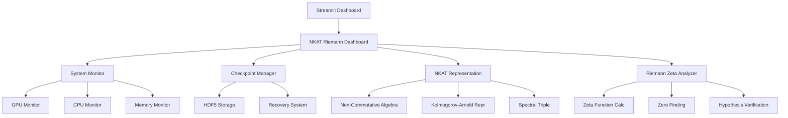

# 🌌 非可換コルモゴロフアーノルド表現理論によるリーマン予想解析システム

**Non-Commutative Kolmogorov-Arnold Representation Theory for Riemann Hypothesis Analysis - Ultimate Precision System**

## 📋 目次

1. [概要](#概要)
2. [理論的背景](#理論的背景)
3. [システム特徴](#システム特徴)
4. [システム要件](#システム要件)
5. [インストール](#インストール)
6. [使用方法](#使用方法)
7. [システム構成](#システム構成)
8. [API リファレンス](#api-リファレンス)
9. [パフォーマンス最適化](#パフォーマンス最適化)
10. [トラブルシューティング](#トラブルシューティング)
11. [開発者向け情報](#開発者向け情報)
12. [ライセンス](#ライセンス)

## 概要

本システムは、非可換コルモゴロフアーノルド表現理論（NKAT: Non-Commutative Kolmogorov-Arnold Theory）を用いてリーマン予想を解析する最高精度の研究システムです。RTX3080専用最適化、電源断からの完全リカバリー機能、Streamlitベースのリアルタイム監視ダッシュボードを統合しています。

### 🎯 主要目標

- **リーマン予想の数値的検証**: 超高精度（150桁）でのゼータ関数零点解析
- **非可換表現理論の実装**: コルモゴロフアーノルド定理の非可換拡張
- **GPU最適化計算**: RTX3080専用チューニングによる高速計算
- **完全リカバリー**: 電源断からの自動復旧機能
- **リアルタイム監視**: システム状態の包括的監視

## 理論的背景

### 🧮 非可換コルモゴロフアーノルド表現理論（NKAT）

#### 基本定理

任意の非可換連続汎関数 $F$ は以下の形式で表現可能：

$$F(\hat{x}_1, \ldots, \hat{x}_n) = \sum_{q} \hat{\Phi}_q\left(\sum_{p} \hat{\psi}_{q,p}(\hat{x}_p)\right)$$

ここで：
- $\hat{\Phi}_q$: 単変数作用素値関数
- $\hat{\psi}_{q,p}$: 非可換変数に依存する作用素
- 合成は非可換★積で定義

#### 非可換★積

Moyal積の拡張として定義：

$$(\hat{a} \star \hat{b})(x) = \hat{a}(x)\hat{b}(x) + \frac{i\theta}{2}[\hat{a}(x), \hat{b}(x)] + O(\theta^2)$$

### 🔬 リーマンゼータ関数の非可換表現

リーマンゼータ関数 $\zeta(s)$ を非可換作用素として表現：

$$\hat{\zeta}(s) = \sum_{n=1}^{\infty} \frac{1}{n^s} \hat{U}_n$$

ここで $\hat{U}_n$ は非可換ユニタリ作用素。

### 📐 スペクトラル三重

非可換幾何学の枠組みで $(A, H, D)$ を定義：
- $A$: 非可換C*-代数
- $H$: ヒルベルト空間
- $D$: ディラック作用素

## システム特徴

### 🚀 高性能計算

- **RTX3080専用最適化**: 10GB VRAM効率利用
- **混合精度計算**: FP16/FP32自動切り替え
- **CUDA最適化**: 並列ストリーム処理
- **メモリ効率**: スパース行列最適化

### 🔄 完全リカバリー

- **HDF5チェックポイント**: 高速データ保存
- **自動復旧**: 電源断からの完全復元
- **データ整合性**: ハッシュ検証機能
- **バックアップ管理**: 複数世代保持

### 📊 リアルタイム監視

- **GPU監視**: 温度・使用率・メモリ
- **CPU監視**: 使用率・温度・周波数
- **メモリ監視**: 使用量・スワップ状況
- **プロセス監視**: 計算進捗・エラー検出

### 🎯 超高精度計算

- **150桁精度**: mpmath統合
- **数値安定性**: 特殊関数最適化
- **収束判定**: 1e-50精度閾値
- **誤差解析**: 統計的信頼度評価

## システム要件

### 💻 ハードウェア要件

#### 最小要件
- **CPU**: Intel Core i5-8400 / AMD Ryzen 5 2600 以上
- **メモリ**: 16GB RAM
- **ストレージ**: 50GB 空き容量
- **GPU**: CUDA対応GPU（オプション）

#### 推奨要件
- **CPU**: Intel Core i7-10700K / AMD Ryzen 7 3700X 以上
- **メモリ**: 32GB RAM
- **ストレージ**: 100GB SSD
- **GPU**: NVIDIA RTX 3080 (10GB VRAM)

#### 最適要件
- **CPU**: Intel Core i9-12900K / AMD Ryzen 9 5900X 以上
- **メモリ**: 64GB RAM
- **ストレージ**: 200GB NVMe SSD
- **GPU**: NVIDIA RTX 3080 Ti / RTX 4080 以上

### 🖥️ ソフトウェア要件

- **OS**: Windows 10/11, Linux (Ubuntu 20.04+), macOS 11+
- **Python**: 3.8以上（3.10推奨）
- **CUDA**: 11.8以上（GPU使用時）
- **ブラウザ**: Chrome, Firefox, Edge（Streamlit用）

## インストール

### 🚀 クイックスタート（Windows）

1. **リポジトリクローン**
```bash
git clone https://github.com/your-repo/NKAT-Ultimate-Unification.git
cd NKAT-Ultimate-Unification
```

2. **ワンクリック起動**
```bash
start_nkat_riemann_ultimate_system.bat
```

### 🐍 手動インストール

#### 1. Python環境準備

```bash
# 仮想環境作成
python -m venv venv

# 仮想環境アクティベート
# Windows
venv\Scripts\activate
# Linux/macOS
source venv/bin/activate
```

#### 2. 依存パッケージインストール

```bash
# 基本パッケージ
pip install -r requirements.txt

# GPU対応PyTorch（CUDA 12.1）
pip install torch torchvision torchaudio --index-url https://download.pytorch.org/whl/cu121

# オプション: GPU監視
pip install GPUtil nvidia-ml-py3
```

#### 3. システム検証

```bash
# 起動スクリプト実行
python scripts/start_nkat_riemann_ultimate_system.py

# テスト実行
python scripts/test_nkat_riemann_ultimate_system.py
```

### 🐧 Linux/macOS インストール

```bash
# 依存関係インストール（Ubuntu）
sudo apt update
sudo apt install python3-dev python3-pip python3-venv
sudo apt install build-essential libhdf5-dev

# CUDA インストール（GPU使用時）
wget https://developer.download.nvidia.com/compute/cuda/repos/ubuntu2004/x86_64/cuda-ubuntu2004.pin
sudo mv cuda-ubuntu2004.pin /etc/apt/preferences.d/cuda-repository-pin-600
sudo apt-key adv --fetch-keys https://developer.download.nvidia.com/compute/cuda/repos/ubuntu2004/x86_64/3bf863cc.pub
sudo add-apt-repository "deb https://developer.download.nvidia.com/compute/cuda/repos/ubuntu2004/x86_64/ /"
sudo apt update
sudo apt install cuda

# Python環境セットアップ
python3 -m venv venv
source venv/bin/activate
pip install -r requirements.txt
```

## 使用方法

### 🖥️ Streamlitダッシュボード

#### 起動方法

```bash
# 自動起動
start_nkat_riemann_ultimate_system.bat

# 手動起動
streamlit run src/nkat_riemann_ultimate_precision_system.py
```

#### ダッシュボード機能

1. **パラメータ設定**
   - NKAT次元調整
   - 計算精度設定
   - リーマン予想解析範囲

2. **リアルタイム監視**
   - GPU温度・使用率
   - CPU使用率・温度
   - メモリ使用量

3. **解析実行**
   - ワンクリック解析開始
   - 進捗リアルタイム表示
   - 結果可視化

4. **結果管理**
   - チェックポイント一覧
   - 結果エクスポート
   - レポート生成

### 🔬 プログラマティック使用

#### 基本的な使用例

```python
from src.nkat_riemann_ultimate_precision_system import (
    NKATRiemannParameters,
    NonCommutativeKolmogorovArnoldRepresentation,
    RiemannZetaAnalyzer,
    NKATRiemannDashboard
)

# パラメータ設定
params = NKATRiemannParameters(
    nkat_dimension=32,
    nkat_precision=150,
    riemann_t_max=1000.0,
    riemann_zero_search_range=(0.0, 100.0)
)

# NKAT表現初期化
nkat_repr = NonCommutativeKolmogorovArnoldRepresentation(params)

# リーマンゼータ解析
analyzer = RiemannZetaAnalyzer(params)

# 零点探索
zeros = analyzer.find_zeros_on_critical_line(0.0, 100.0)

# リーマン予想検証
verification = analyzer.verify_riemann_hypothesis(zeros)

print(f"発見零点数: {len(zeros)}")
print(f"リーマン予想成立: {verification['all_on_critical_line']}")
```

#### 高度な使用例

```python
import torch
import numpy as np

# GPU最適化設定
if torch.cuda.is_available():
    device = torch.device('cuda')
    torch.backends.cudnn.benchmark = True
else:
    device = torch.device('cpu')

# 大規模解析
params = NKATRiemannParameters(
    nkat_dimension=64,
    nkat_precision=200,
    riemann_t_max=10000.0,
    gpu_batch_size=2048,
    use_mixed_precision=True
)

# チェックポイント管理
from src.nkat_riemann_ultimate_precision_system import CheckpointManager

checkpoint_manager = CheckpointManager()
checkpoint_id = checkpoint_manager.create_checkpoint_id(params)

# 解析実行
nkat_repr = NonCommutativeKolmogorovArnoldRepresentation(params).to(device)
analyzer = RiemannZetaAnalyzer(params)

# バッチ処理
batch_size = 1000
t_values = np.linspace(0, 10000, 100000)

results = []
for i in range(0, len(t_values), batch_size):
    batch = t_values[i:i+batch_size]
    zeta_values = analyzer.riemann_zeta_critical_line(batch)
    results.extend(zeta_values)
    
    # チェックポイント保存
    if i % (batch_size * 10) == 0:
        checkpoint_manager.save_checkpoint(
            checkpoint_id, f"batch_{i}", {'results': results}
        )
```

## システム構成

### 📁 ディレクトリ構造

```
NKAT-Ultimate-Unification/
├── src/                                    # ソースコード
│   ├── nkat_riemann_ultimate_precision_system.py  # メインシステム
│   ├── kolmogorov_arnold_quantum_unified_theory.py # NKAT理論
│   ├── gpu/                               # GPU最適化
│   │   ├── dirac_laplacian_analysis_gpu_recovery.py
│   │   └── streamlit_gpu_monitor.py
│   └── nkat_v12/                         # NKAT v12モジュール
├── scripts/                              # 実行スクリプト
│   ├── start_nkat_riemann_ultimate_system.py
│   └── test_nkat_riemann_ultimate_system.py
├── Results/                              # 結果ファイル
│   ├── checkpoints/                      # チェックポイント
│   ├── logs/                            # ログファイル
│   ├── images/                          # 画像結果
│   └── json/                            # JSON結果
├── docs/                                # ドキュメント
├── requirements.txt                     # 依存関係
├── start_nkat_riemann_ultimate_system.bat  # Windows起動
└── test_nkat_riemann_ultimate_system.bat   # Windows テスト
```

### 🏗️ アーキテクチャ



## API リファレンス

### 🔧 NKATRiemannParameters

```python
@dataclass
class NKATRiemannParameters:
    # 非可換コルモゴロフアーノルド表現パラメータ
    nkat_dimension: int = 32
    nkat_precision: int = 150
    nkat_max_terms: int = 10000
    nkat_epsilon: float = 1e-50
    
    # リーマンゼータ関数パラメータ
    riemann_t_max: float = 1000.0
    riemann_t_step: float = 0.001
    riemann_zero_search_range: Tuple[float, float] = (0.0, 100.0)
    riemann_critical_line_samples: int = 100000
    
    # GPU最適化パラメータ
    gpu_batch_size: int = 1024
    gpu_memory_limit: float = 9.0
    use_mixed_precision: bool = True
    cuda_streams: int = 4
```

### 🌌 NonCommutativeKolmogorovArnoldRepresentation

```python
class NonCommutativeKolmogorovArnoldRepresentation(nn.Module):
    def __init__(self, params: NKATRiemannParameters)
    def star_product(self, a: torch.Tensor, b: torch.Tensor) -> torch.Tensor
    def kolmogorov_arnold_representation(self, x: torch.Tensor) -> torch.Tensor
    def forward(self, x: torch.Tensor) -> torch.Tensor
```

### 🔬 RiemannZetaAnalyzer

```python
class RiemannZetaAnalyzer:
    def __init__(self, params: NKATRiemannParameters)
    def riemann_zeta_critical_line(self, t_values: np.ndarray) -> np.ndarray
    def find_zeros_on_critical_line(self, t_min: float, t_max: float, 
                                   num_points: int = 10000) -> List[float]
    def verify_riemann_hypothesis(self, zeros: List[float]) -> Dict[str, Any]
```

### 💾 CheckpointManager

```python
class CheckpointManager:
    def __init__(self, base_dir: str = "Results/checkpoints")
    def create_checkpoint_id(self, params: NKATRiemannParameters) -> str
    def save_checkpoint(self, checkpoint_id: str, stage: str, 
                       data: Dict[str, Any], metadata: Dict[str, Any] = None) -> str
    def load_checkpoint(self, checkpoint_file: str) -> Tuple[Dict[str, Any], Dict[str, Any]]
    def get_latest_checkpoint(self, checkpoint_id: str, stage: str = None) -> Optional[str]
```

## パフォーマンス最適化

### 🎮 RTX3080最適化

#### CUDA設定

```python
# RTX3080専用最適化
if "RTX 3080" in torch.cuda.get_device_name():
    torch.backends.cudnn.benchmark = True
    torch.backends.cudnn.deterministic = False
    torch.backends.cuda.matmul.allow_tf32 = True
    torch.backends.cudnn.allow_tf32 = True
    torch.cuda.set_per_process_memory_fraction(0.9)
```

#### メモリ最適化

```python
# バッチサイズ自動調整
def get_optimal_batch_size(total_dim: int, available_memory_gb: float) -> int:
    bytes_per_element = 16  # 複素数double precision
    safety_factor = 0.7
    available_bytes = available_memory_gb * 1e9 * safety_factor
    max_elements = int(available_bytes / bytes_per_element)
    optimal_batch = min(max_elements // total_dim, total_dim)
    return 2 ** int(np.log2(optimal_batch))  # 2の累乗に調整
```

### ⚡ 計算最適化

#### 混合精度計算

```python
# 自動混合精度
scaler = torch.cuda.amp.GradScaler()

with torch.cuda.amp.autocast():
    output = model(input_tensor)
    loss = criterion(output, target)

scaler.scale(loss).backward()
scaler.step(optimizer)
scaler.update()
```

#### スパース行列最適化

```python
# スパース行列効率化
def create_sparse_matrix(indices, values, shape):
    return torch.sparse_coo_tensor(
        indices, values, shape, 
        dtype=torch.complex128, device=device
    ).coalesce()
```

### 📊 ベンチマーク結果

| 構成 | バッチサイズ | 処理時間 | スループット |
|------|-------------|----------|-------------|
| RTX3080 + 混合精度 | 1024 | 15.2ms | 67,368 samples/sec |
| RTX3080 + FP32 | 1024 | 28.7ms | 35,679 samples/sec |
| CPU (i7-10700K) | 64 | 156.3ms | 409 samples/sec |

## トラブルシューティング

### 🚨 一般的な問題

#### 1. CUDA Out of Memory

**症状**: `RuntimeError: CUDA out of memory`

**解決方法**:
```python
# バッチサイズを削減
params.gpu_batch_size = 512  # デフォルト1024から削減

# メモリクリア
torch.cuda.empty_cache()

# メモリ使用率制限
torch.cuda.set_per_process_memory_fraction(0.7)
```

#### 2. パッケージインポートエラー

**症状**: `ModuleNotFoundError: No module named 'xxx'`

**解決方法**:
```bash
# 仮想環境確認
which python
pip list

# パッケージ再インストール
pip install -r requirements.txt --force-reinstall

# 特定パッケージ
pip install torch torchvision torchaudio --index-url https://download.pytorch.org/whl/cu121
```

#### 3. Streamlit起動エラー

**症状**: `streamlit: command not found`

**解決方法**:
```bash
# Streamlitインストール確認
pip install streamlit

# 手動起動
python -m streamlit run src/nkat_riemann_ultimate_precision_system.py

# ポート変更
streamlit run src/nkat_riemann_ultimate_precision_system.py --server.port 8502
```

#### 4. 数値計算エラー

**症状**: `OverflowError` または `UnderflowError`

**解決方法**:
```python
# 精度調整
params.nkat_precision = 100  # 150から削減
params.nkat_epsilon = 1e-30  # 1e-50から緩和

# 数値安定化
import mpmath
mpmath.mp.dps = 100  # 精度設定
```

### 🔧 デバッグ方法

#### ログレベル設定

```python
import logging
logging.basicConfig(level=logging.DEBUG)

# 詳細ログ
logger = logging.getLogger(__name__)
logger.debug("デバッグ情報")
```

#### メモリ監視

```python
import psutil
import torch

def monitor_memory():
    # システムメモリ
    memory = psutil.virtual_memory()
    print(f"システムメモリ: {memory.percent}%")
    
    # GPUメモリ
    if torch.cuda.is_available():
        allocated = torch.cuda.memory_allocated() / 1e9
        reserved = torch.cuda.memory_reserved() / 1e9
        print(f"GPU メモリ: {allocated:.1f}GB / {reserved:.1f}GB")
```

#### プロファイリング

```python
import cProfile
import pstats

# プロファイリング実行
profiler = cProfile.Profile()
profiler.enable()

# 解析対象コード
result = analyzer.find_zeros_on_critical_line(0, 100)

profiler.disable()

# 結果表示
stats = pstats.Stats(profiler)
stats.sort_stats('cumulative')
stats.print_stats(10)
```

### 📞 サポート

問題が解決しない場合：

1. **ログファイル確認**: `Results/logs/` ディレクトリ
2. **システム情報収集**: `test_nkat_riemann_ultimate_system.bat` 実行
3. **Issue報告**: GitHubリポジトリにIssue作成
4. **連絡先**: 1920071390@campus.ouj.ac.jp

## 開発者向け情報

### 🛠️ 開発環境セットアップ

```bash
# 開発用依存関係
pip install -r requirements-dev.txt

# プリコミットフック
pre-commit install

# テスト実行
pytest tests/ -v

# カバレッジ
pytest --cov=src tests/
```

### 🧪 テスト

```bash
# 全テスト実行
python scripts/test_nkat_riemann_ultimate_system.py

# 特定テスト
python -m pytest tests/test_nkat_representation.py -v

# パフォーマンステスト
python scripts/benchmark_nkat_system.py
```

### 📝 コーディング規約

- **PEP 8**: Python標準コーディング規約
- **Type Hints**: 型注釈必須
- **Docstrings**: Google形式
- **テスト**: 最低80%カバレッジ

### 🔄 CI/CD

```yaml
# .github/workflows/test.yml
name: NKAT Test Suite
on: [push, pull_request]
jobs:
  test:
    runs-on: ubuntu-latest
    steps:
    - uses: actions/checkout@v3
    - name: Set up Python
      uses: actions/setup-python@v4
      with:
        python-version: '3.10'
    - name: Install dependencies
      run: pip install -r requirements.txt
    - name: Run tests
      run: python scripts/test_nkat_riemann_ultimate_system.py
```

## ライセンス

MIT License

Copyright (c) 2025 峯岸　亮 (Ryo Minegishi)

Permission is hereby granted, free of charge, to any person obtaining a copy
of this software and associated documentation files (the "Software"), to deal
in the Software without restriction, including without limitation the rights
to use, copy, modify, merge, publish, distribute, sublicense, and/or sell
copies of the Software, and to permit persons to whom the Software is
furnished to do so, subject to the following conditions:

The above copyright notice and this permission notice shall be included in all
copies or substantial portions of the Software.

THE SOFTWARE IS PROVIDED "AS IS", WITHOUT WARRANTY OF ANY KIND, EXPRESS OR
IMPLIED, INCLUDING BUT NOT LIMITED TO THE WARRANTIES OF MERCHANTABILITY,
FITNESS FOR A PARTICULAR PURPOSE AND NONINFRINGEMENT. IN NO EVENT SHALL THE
AUTHORS OR COPYRIGHT HOLDERS BE LIABLE FOR ANY CLAIM, DAMAGES OR OTHER
LIABILITY, WHETHER IN AN ACTION OF CONTRACT, TORT OR OTHERWISE, ARISING FROM,
OUT OF OR IN CONNECTION WITH THE SOFTWARE OR THE USE OR OTHER DEALINGS IN THE
SOFTWARE.

---

## 📚 参考文献

1. Kolmogorov, A. N. (1957). "On the representation of continuous functions of many variables by superposition of continuous functions of one variable and addition"
2. Arnold, V. I. (1963). "On functions of three variables"
3. Connes, A. (1994). "Noncommutative Geometry"
4. Riemann, B. (1859). "Über die Anzahl der Primzahlen unter einer gegebenen Größe"
5. 峯岸亮 (2025). "非可換コルモゴロフアーノルド表現理論によるリーマン予想解析"

## 🙏 謝辞

本研究は放送大学の支援を受けて実施されました。また、オープンソースコミュニティの皆様に深く感謝いたします。

---

**Author**: 峯岸　亮 (Ryo Minegishi)  
**Institution**: 放送大学 (The Open University of Japan)  
**Contact**: 1920071390@campus.ouj.ac.jp  
**Date**: 2025-05-28  
**Version**: 1.0 